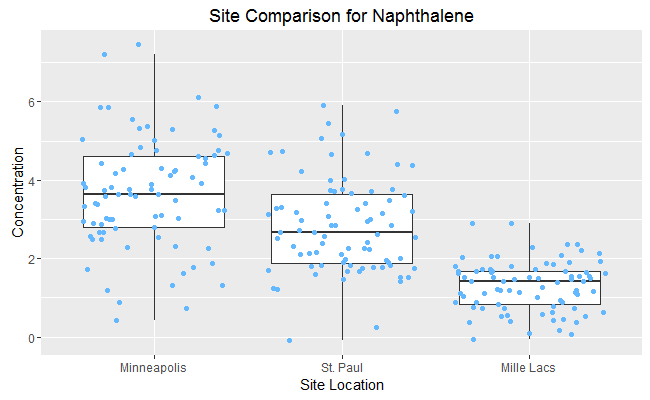
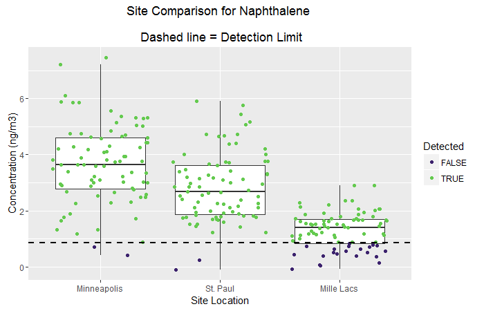

  
  
  The chart below combines a boxplot & scatterplot to display an overview of pollutant concentrations observed in 3 different cities. 

## Load packages
```{r, message=F}
library(ggplot2)
library(dplyr)

```

## Create example data
```{r}

# Create random sample data using rnorm()
sample_data <- data.frame(Pollutant = "Naphthalene", 
                          Concentration = c(rnorm(80, 3.6, 1.4),
                                            rnorm(80, 3.0, 1.2),
                                            rnorm(80, 1.4, 0.6)),
                          Site = c(rep("Minneapolis", 80),
                                   rep("St. Paul", 80),
                                   rep("Mille Lacs", 80)),
                          MDL = 0.85)


```

## Create the boxplot / scatterplot using `geom_jitter()`
```{r}

# Groups the data by sampling site
ggplot(data= sample_data, 
       aes(x= factor(Site, levels=c("Minneapolis","St. Paul","Mille Lacs")),            y= Concentration)) +
    geom_boxplot(outlier.colour= NA) +  # Prevents double charting of outliers
    geom_jitter(color="steelblue1") +
    xlab("Site Location") +
    ggtitle("Site Comparison for Naphthalene")

``` 




## Add a detection limit line and highlight non-detected points
```{r}

# Create new column that checks if sample is above detetion limit
sample_data$Detected  <-  sample_data$Concentration >= sample_data$MDL

# Groups the data by sampling site
ggplot(data= sample_data, aes(x= factor(Site, levels=c("Minneapolis","St. Paul","Mille Lacs")), y= Concentration)) +
    scale_colour_manual(values= c("#3C226D", "#64CA4F")) +  # Purple and green
    geom_boxplot(outlier.colour= NA) + # Prevents double charting of outliers
    geom_jitter(aes(color= Detected)) +       # Color by detected
    geom_hline(yintercept= sample_data$MDL, size=1, linetype="dashed") + # Add detection line
    xlab("Site Location") +
    ylab("Concentration (ng/m3)") +
    ggtitle("Site Comparison for Naphthalene \n\n Dashed line = Detection Limit")

``` 




[> Return to main page](../../README.md)