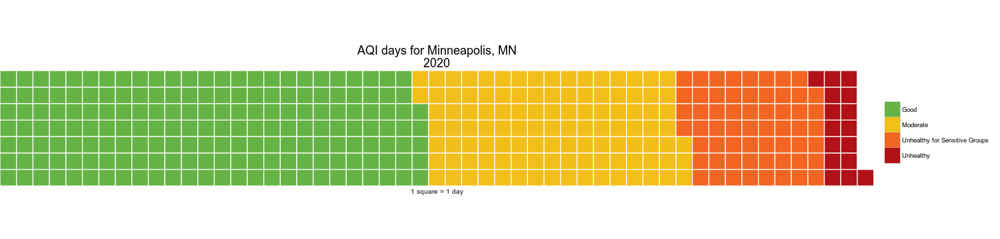
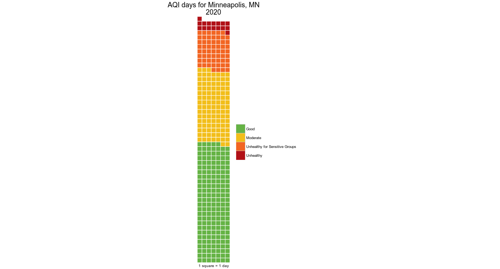
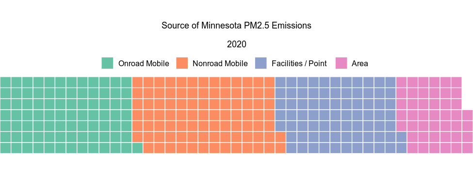

  

The waffle chart below display the future distribution of AQI days for Minneapolis, MN.

## Load packages
```{r, message=F}
#devtools::install_github("hrbrmstr/waffle")
library(waffle)

```

## Create example AQI data
```{r}

minne_aqi <- c(`Good` = 180, 
               `Moderate`  = 110, 
               `Unhealthy for sensitive groups` = 59, 
               `Unhealthy` = 16)

aqi_colors <- c("#65B345", "#F2BE1A", "#F26522", "#B11117")
```

## Create the waffle plot
```{r}
waffle(minne_aqi, 
       rows=7, 
       size=0.6, 
       colors=aqi_colors,
       xlab="1 square = 1 day",
       title="AQI days for Minneapolis, MN\n2020")
``` 




## Use `flip=TRUE` to make a vertical waffle
```{r}
waffle(minne_aqi, 
       rows=7, 
       size=0.5, 
       colors=aqi_colors,
       xlab="1 square = 1 day",
       title="AQI days for Minneapolis, MN\n2020",
       flip=T)
```



## To melt multiple waffles together use the `iron` function

```{r, tidy=T}
# For year 2020
aqi_2020 <- waffle(minne_aqi, 
       rows=7, 
       size=0.6, 
       colors=aqi_colors,
       xlab="\n",
       title="AQI days for Minneapolis, MN\n\n2020") + 
  theme(legend.position="left", legend.text=element_text(size=11))

# For year 2025
## Create data
minne_aqi_2025 <- c(`Good` = 240, 
                    `Moderate`  = 92, 
                    `Unhealthy for sensitive groups` = 29, 
                    `Unhealthy` = 4)

aqi_2025 <- waffle(minne_aqi_2025, 
       rows=7, 
       size=0.6, 
       colors=aqi_colors,
       xlab="1 square = 1 day",
       title="2025") + 
  theme(legend.position="left", legend.text=element_text(size=11))

# Stack 2020 and 2025  waffles
iron(aqi_2020, aqi_2025)
````` 


## An emissions inventory example

```{r, tidy=T}

ei_pm25 <-  c(`  Onroad Mobile   ` = 85, 
              `  Nonroad Mobile   `  = 92, 
              `  Facilities / Point    ` = 77, 
              `  Area   ` = 44)

  
# For year 2020
ei_waffle <- waffle(ei_pm25, 
       rows=7, 
       size=0.6, 
       xlab="\n",
       title="Source of Minnesota PM2.5 Emissions\n\n2020")

ei_waffle + guides(fill = guide_legend(position="top", override.aes = list(colour = NULL), label.theme = element_text(size = 16, angle=0))) + 
  theme(legend.position="top")

````` 



