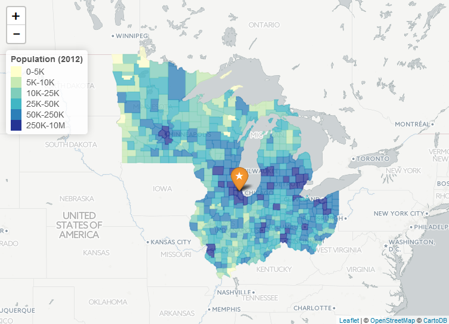
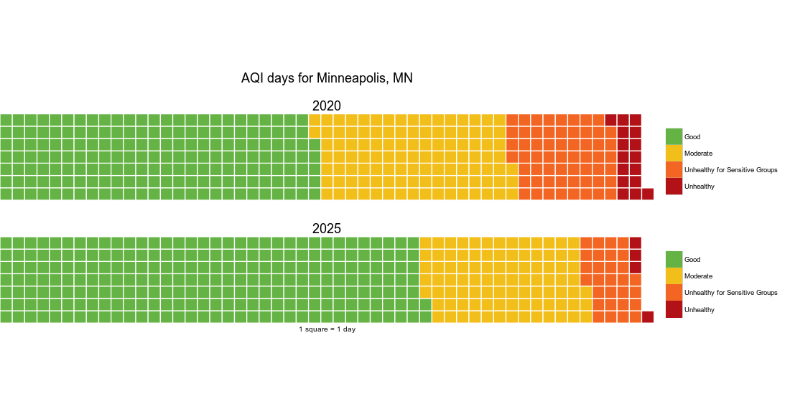
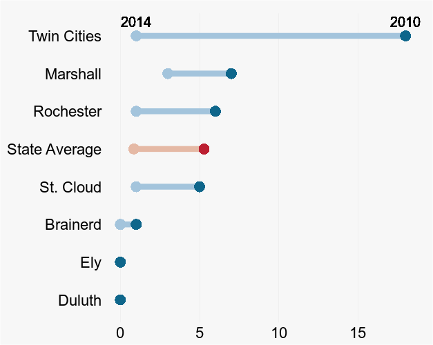

# Chart Gallery
Click on an image to view the R script and data that produced it.  

### Table of Contents  
[Maps](#maps)  
[Visuals](#visuals)  
[Boxplots](#boxplots)  
[Time Series](#timeseries)  

## Maps <a name="maps"/>
___  

#### LADCO County Populations (Leaflet)  
   
 
#### Indiana monitoring sites (Leaflet)  
  
  
  
#### PAH concentrations w/ color legend (Leaflet)  

  

## Visuals <a name="visuals"/>
___  

#### Waffle chart: birds eye view of 365 AQI days
 

#### DumbBell chart of decreasing AQI alert days
  

#### Wordcloud of PAHs weighted by detection frequency
  

## Boxplots <a name="boxplots"/>
___ 

#### Distribution summary with boxplot / scatterplot and added detection limit (MDL)
 

## Time Series <a name="timeseries"/>
___  

_currently empty_
